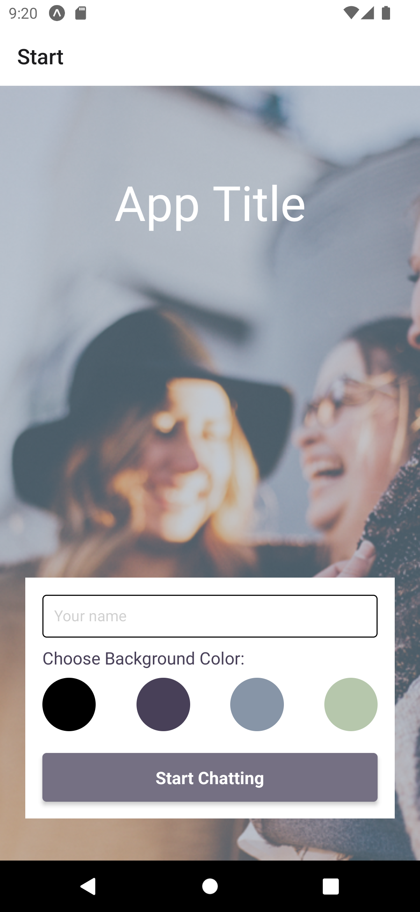
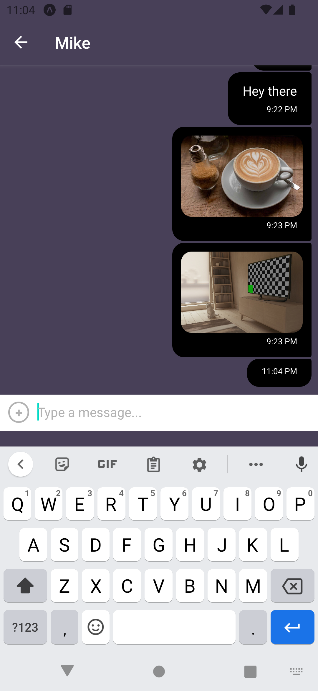

# React Native Mobile Chat App

## Description

It is a chat app for mobile devices using React Native. The app will provide users with a chat interface and options to share images and their location.

## Images




## User Stories

- As a new user, I want to be able to easily enter a chat room so I can quickly start talking to my friends and family.
- As a user, I want to be able to send messages to my friends and family members to exchange the latest news.
- As a user, I want to send images to my friends to show them what I’m currently doing.
- As a user, I want to share my location with my friends to show them where I am.
- As a user, I want to be able to read my messages offline so I can reread conversations at any time.
- As a user with a visual impairment, I want to use a chat app that is compatible with a screen reader so that I can engage with a chat interface.

## Key Features

- A page where users can enter their name and choose a background color for the chat screen before joining the chat.
- A page displaying the conversation, as well as an input field and submit button.
- The chat must provide users with two additional communication features: sending images and location data.
- Data gets stored online and offline.

## Technical Requirements

- The app is written in React Native.
- The app is developed using Expo.
- The app is styled according to the given screen design.
- Chat conversations are stored in Google Firestore Database.
- The app authenticates users anonymously via Google Firebase authentication.
- Chat conversations are stored locally.
- The app lets users pick and send images from the phone’s image library.
- The app lets users take pictures with the device’s camera app, and send them.
- The app stores images in Firebase Cloud Storage.
- The app is able to read the user’s location data.

## Technologies

- React Native
- Expo
- Android Studio
- Firebase (Google Cloud)
- Gifted Chat

## Dependencies

see the [package.json](/package.json)

## How to set up

### Prerequisites

register and create a new project @ https://expo.dev/

```
npm install expo-cli -g
```

For Windows and Linux: Install
[Android Studio](https://developer.android.com/studio).
For more information how to set up an emulator, look [here](https://docs.expo.dev/workflow/android-studio-emulator/?redirected)

For Mac: Install [XCode](https://developer.apple.com/xcode/)

Install the Expo app on your mobile device (available in Google Play Store and Apple Store)

### Install database

Create Google Firebase/Firestore account for data storage.
[Firebase documentation](https://firebase.google.com/docs/web/setup)

1. Sign into https://firebase.google.com/ to get started

2. Click on "create a project" and follow the steps. Start in test mode then start a collection, ("Auto-ID" to generate a random Document ID).

3. Install Firestore via Firebase: `npm install firebase`

4. Create a new directory "config" and add a new file "firebase.js" to it.

5. Back in the Firebase project in the browser, open up "Settings", then "General" tab. Under the section "Your apps", link Firebase to app by clicking the tag icon.

6. After connecting, it will generate configurations for different platforms. Here, click "Firestore for Web" and then copy the contents of the config object info to config/firebaseConfig.dist.js file. Initialize the App by adding `import firebase from firebase` at the top of the file firebase.js and initialize the app there like so: `const firebaseApp = initializeApp(firebaseConfig)`

7. Change the name in the reference to the Firestore collection in components/chat.js file from currently "messages" to the name choosen for the collection.

### Getting started

- Install all the dependencies:
  `npm i`

- Start the app by:
  `expo start` or `npm start`

- Launch app on smartphone:
  scan QR code or type in respective abbreviations (displayed in terminal) in Expo GUI

- Launch app on emulator:
  Press "Run on Android device/emulator" or "Run on iOS emulator" or "run in web browser" in Expo GUI

## Learnings

## ...from React Native

Especially towards the end of the project I experienced dificculties with CustomActions as it did not pop up.
After a while I realized that I needed to downgrade the newest version to "react-native-gifted-chat":
"^0.16.3" in order to accept methods like that.

## ...from Firebase Cloud

Despite being

## ...from Expo & Android Studio

I saw the app crashing several times when leaving the chat, which is said to happen frequnetly at other developers, too. It took me a while to fix it, however.
On the other hand, Android Studio (desktop & mobile) took me some time to grasp the functionaliy and logic behind it. But after all, it is worth working with as a tool to develop and test native apps based on React Native.

## ...from the project

Considering the scope of the development environment, I had to fix problems from potentially three sources. Given the fact that I firstly used those instruments did not make it easier. Nonetheless, I found it enriching insofar as I made the experioence of how to use three powerful tools (Firebase, Expo & Android Studio, React Native) of modern web development for future projects .
